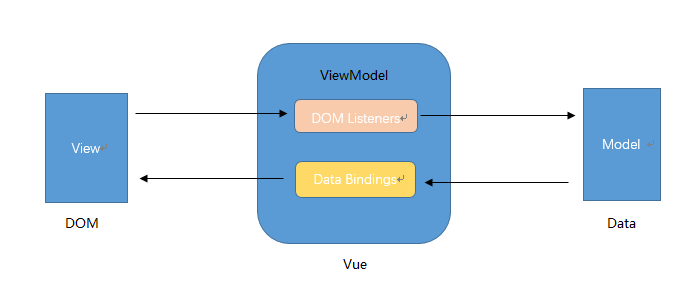

# 设计模式

## 观察者模式（Observer）

* 又被称为发布-订阅者模式

1. Vue响应式原理
observer -> dep（观察者） -> watcher（订阅者）
observer通过Object.defineProperty / proxy 对数据进行拦截，在get通过dep收集watcher，在set通过dep通知所有收集的watcher进行视图更新

```js
  class Dep {
    add() {}, // 添加订阅者
    remove() {}, // 移除订阅者
    depend() {}, // 收集依赖（调用watcher.addDep方法将dep的id存在watcher里防止重复添加，watcher再调用dep.add方法将自己存在dep里）
    notify() {}, // 通知所有订阅者
  }
```

## MVVM模式

* 由Model (模型)、View (视图)和ViewModel (视图模型)三部分组成



ViewMode是连接Model和View的桥，View通过事件绑定Model，Model通过数据绑定View，通过ViewMode可以实现数据和视图的完全分离

## 工厂模式

1. 用到很多new操作符的地方

```js
  class Dog {}
  class Cat {}

  function buyGog(type) {
    switch(type) {
      case 'dog':
        return new Dog()
      case 'cat':
        return new Cat()
    }
  }
```

## 单例模式

将所有方法都放在一个对象里面，单例模式常用来定义命名空间如jQuery，我们要使用jq的某个方法：$.ready()

```js
  const $ = {
    ready() {},
    on() {},
    off() {},
    ...
  }
```

Vue中封装好的axios，全局状态管理store都是单例模式

## 策略模式

表单字段正则校验

```js
  function verify(type, value) {
    const rules = {
      notNull() {}, // 不为空
      number() {}, // 是否是数字
      phone() {}, // 是否是电话号码
    }

    return rules[type](value)
  }
```
