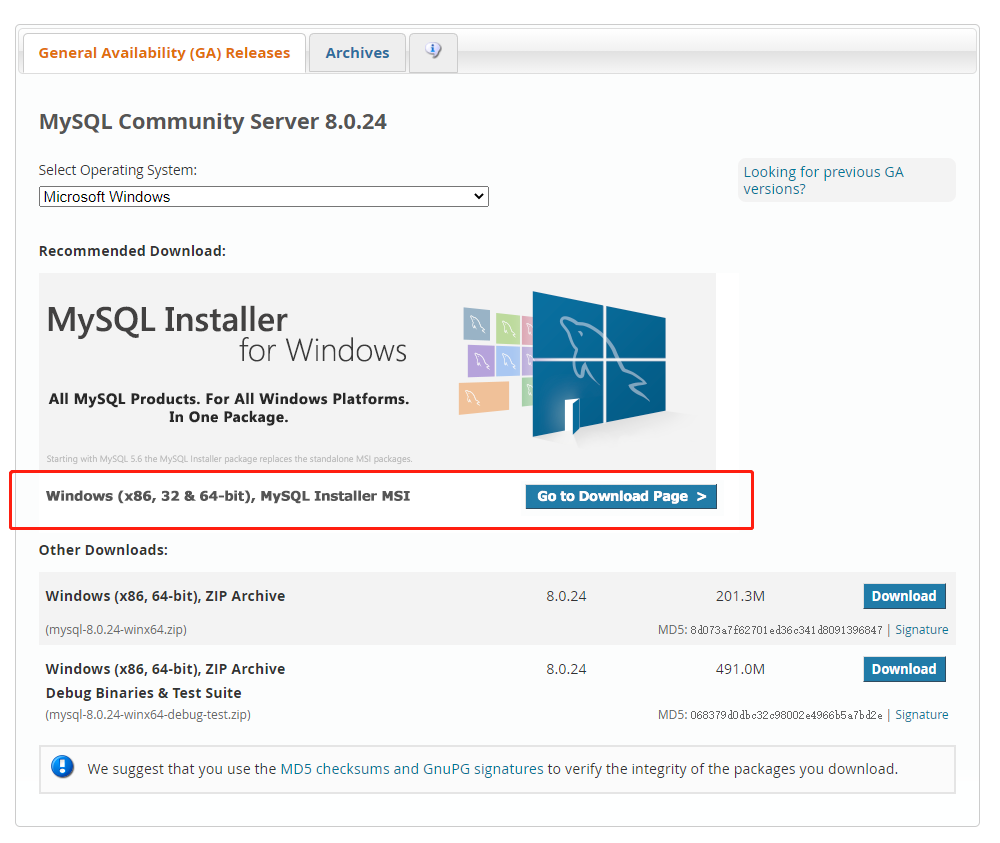
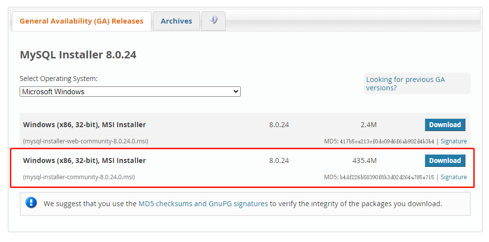
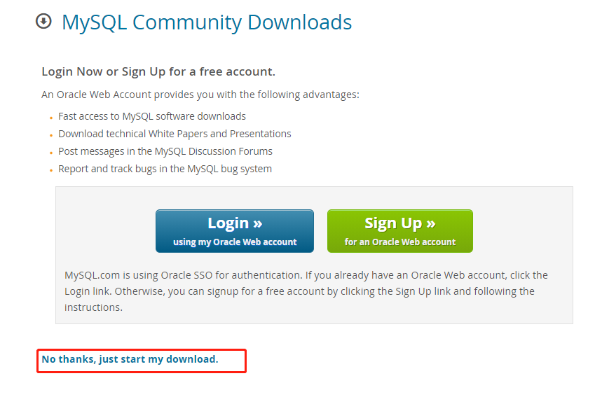

# 旨在学习 koa2

参考 [https://www.bilibili.com/video/BV1gV411B7AU?p=8&spm_id_from=pageDriver](https://www.bilibili.com/video/BV1gV411B7AU?p=8&spm_id_from=pageDriver)

# 初始化安装

```js
yarn init -y
yarn add koa2
```

# 洋葱模型

# 安装路由

```js
yarn add koa-router
```

# 安装 mysql

- 官网[https://www.mysql.com/](https://www.mysql.com/)
- Downloads -> MySQL Community Downloads -> MySQL Community Server
  
  
  
- 配置环境变量

```js
我的电脑 -> 属性 -> 高级系统设置 -> 环境变量 -> 系统环境变量 -> path（编辑） -> C:\Program Files\MySQL\MySQL Server 8.0\bin（新建）
```

# 数据库操作

## 连接数据库

```js
// 连接 默认用户名是root 密码设置的是123456
mysql - uroot - p;
123456;
// 退出
exit;
```

## 创建删除与查看库

```js
// sql 语句都要加;结尾
// 查看
show databases;
// 创建
create database test;
// 删除
drop database test;
// 选择库
use test;
```

## 表操作

```js
// 查看
show tables;
// 删除
drop table banner;
/*
* 创建
* 新建一个banner表 里面有 id 等 字段
*/
create table banner(
  id INT NOT NULL AUTO_INCREMENT,
  title VARCHAR(100) NOT NULL,
  author VARCHAR(40) NOT NULL,
  submission_date DATE,
  PRIMARY KEY ( id )
)ENGINE=InnoDB DEFAULT CHARSET=utf8;
// 往表里添加数据
insert into banner
  (title, author, submission_date)
  VALUES
  ("学习 MySQL", "菜鸟教程", NOW());
// 选择
select * from banner;
// 清空
delete from banner;
// 表详情
describl article;
// 更新
update banner set title = 'study' where id=3;
```

## Navicat 连接 Mysql 报错：Client does not support authentication protocol requested by server

```js
mysql> use mysql;
mysql> alter user 'root'@'localhost' identified with mysql_native_password by '123456';
mysql> flush privileges;
```
